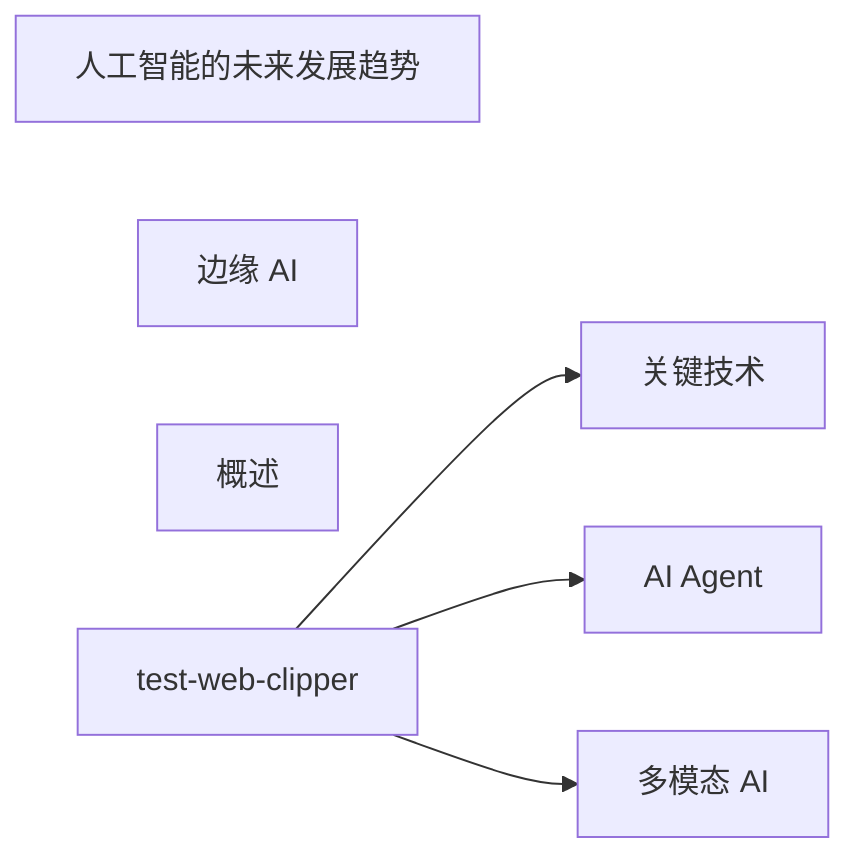

# 知识图谱

> 自动生成的知识网络

```mermaid
flowchart LR
    AI-Agent["AI Agent"]
    人工智能的未来发展趋势["人工智能的未来发展趋势"]
    边缘-AI["边缘 AI"]
    多模态-AI["多模态 AI"]
    概述["概述"]
    关键技术["关键技术"]

    test-web-clipper --> 关键技术
    test-web-clipper --> AI-Agent
    test-web-clipper --> 多模态-AI
```

---

## 统计

- 概念数量: 6
- 关联数量: 3
- 更新于: 2026-05-07 00:17:36
